# Compass YouTube API compliance audit package

Status: preparation in progress  
Prepared: 2026-08-07  
Applicant organization: Open Range Construction, Ltd.  
API client: Compass  
Primary URL: https://compass.openrangeconstruction.ltd

## Purpose

Compass is an authenticated construction project-management application. Its
YouTube integration lets authorized internal staff stage project videos, review
their metadata and audience, and publish them to a company-managed YouTube
channel. Compass adds the resulting playback link to the relevant project record
or Daily Log. Compass does not provide YouTube search, recommendations, channel
analytics, advertising, or a replacement YouTube experience.

The audit is needed because videos uploaded by an unaudited API project are
restricted to private viewing. Approval will allow authorized staff to choose
unlisted or public publication where appropriate. Staff-only distribution will
default to unlisted after approval because YouTube private videos are viewable
only by the channel account, not the full Compass staff audience.

## User flow

```mermaid
flowchart LR
  A["Authorized staff device or project text/email"] --> B["Compass authenticated intake"]
  B --> C["Google Drive staging folder"]
  C --> D["Staff review: title, description, audience, channel"]
  D --> E["Explicit publish action"]
  E --> F["YouTube Data API resumable upload"]
  F --> G["ORC, HPS, or Nu-Tech company channel"]
  G --> H["YouTube playback link"]
  H --> I["Compass project video record / Daily Log"]
```

## Access and security controls

- WorkOS authenticates Compass users.
- Compass role and project-access checks run before project media can be read or
  changed.
- Only internal staff with project-update permission can connect a YouTube
  channel, review a video, or publish it.
- OAuth state is stored in a short-lived, HTTP-only, secure, same-site cookie and
  verified on callback.
- OAuth refresh tokens are encrypted before database storage and used only on
  the server.
- Channel connections are organization-scoped and channel-key scoped.
- The publishing screen shows the destination channel, intended audience, and
  YouTube visibility before upload.
- Public publication requires a separate explicit confirmation.
- Authorized staff can disconnect a channel. Compass removes the stored token
  record and attempts to revoke the Google OAuth grant.
- Users can also revoke access from Google Account permissions.
- Publication and connection activity is auditable in Compass.

## Requested OAuth scopes

- `openid`
- `email`
- `https://www.googleapis.com/auth/youtube.readonly`
- `https://www.googleapis.com/auth/youtube.upload`

The identity scopes identify the Google account completing authorization. The
read-only YouTube scope identifies the managed channel. The upload scope creates
the explicitly approved video upload. Compass does not request access to delete
videos, read private user activity, manage comments, or access YouTube Analytics.

## Data stored

- Google account email used for the connection
- YouTube channel ID and channel title
- Granted OAuth scopes and connection timestamps
- Encrypted OAuth refresh token
- Staff-entered video title, description, audience, and destination channel
- Source Drive file ID and published YouTube video ID/URL
- Upload status, errors, and activity timestamps

## Retention and deletion

Connection metadata and the encrypted refresh token remain only while the
connection is active or as required in security records. Disconnecting removes
the connection record and attempts OAuth revocation. A Google user can also
revoke Compass from Google Account permissions. Project videos follow the
organization's project-record retention requirements. A channel manager can
remove an already-published video in YouTube Studio.

## Public compliance URLs

- Privacy Policy: https://compass.openrangeconstruction.ltd/privacy
- Terms of Service: https://compass.openrangeconstruction.ltd/terms
- Google Privacy Policy: https://policies.google.com/privacy
- Google API Services User Data Policy:
  https://developers.google.com/terms/api-services-user-data-policy
- YouTube Terms of Service: https://www.youtube.com/t/terms

## Required evidence checklist

- [ ] Homepage screenshot showing Compass name and Privacy / Terms links
- [ ] Privacy Policy screenshots showing Google/YouTube disclosure, Google
      Privacy Policy link, Limited Use statement, retention, deletion, and
      revocation
- [ ] Terms screenshot showing YouTube Terms and Community Guidelines
- [ ] OAuth consent screenshots showing application name and requested scopes
- [ ] Project-video upload screenshot
- [ ] Video review screenshot showing title, description, channel, audience,
      privacy explanation, and public confirmation
- [ ] Published-video / Daily Log link screenshot
- [ ] YouTube channel connection and disconnect controls screenshot
- [ ] Architecture diagram exported to PDF or PNG
- [ ] User-flow diagram exported to PDF or PNG
- [ ] Reviewer demo-account instructions
- [ ] Google Cloud project number
- [ ] Legal contact name, business address, phone, and submission email

## Post-approval activation

Compass contains a fail-closed `YOUTUBE_API_AUDIT_APPROVED` feature switch.
Production must leave it unset until Google confirms approval. After approval:

YouTube API Services confirmed on 2026-08-25 that the compliance review was
complete and that no further action was required. The approval correspondence
is preserved in the original compliance-review email thread.

1. Set `YOUTUBE_API_AUDIT_APPROVED=true` in the production Worker environment.
2. Reconnect each managed YouTube channel if Google requires refreshed consent.
3. Re-upload videos that Google locked private; existing locked uploads cannot be
   converted by the unaudited API client.
4. Verify an unlisted staff video with sound on desktop and mobile.
5. Verify owner/sub and public audience behavior.
6. Record the approval date and audit correspondence in this document.
